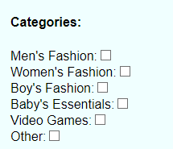

# Files

## categories.component.html

contains component template

## categories.component.css

contains component style

## categories.component.ts

contains component template functionality and data

## categories.component.spec.ts

to test component

# Screen Shot

