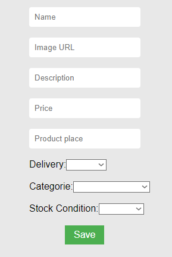

# Files

## make-new-prod.component.html

contains component template

## make-new-prod.component.css

contains component style

## make-new-prod.component.ts

contains component template functionality and data

## make-new-prod.component.spec.ts

to test component

# Screen Shot

